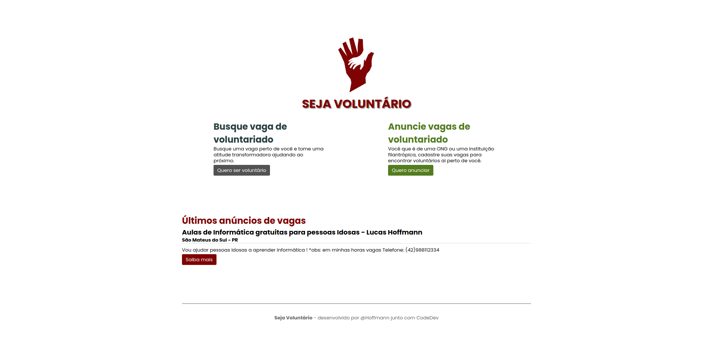
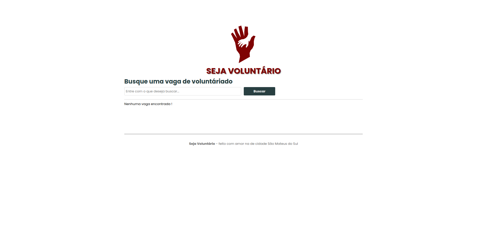

<h1 align="center">
 
  
 
 
</h1>

Anúncio de vagas de voluntariado e registro de vagas para voluntarios!

 
 

Seja Voluntario por CodeDev

 
<h2>Responsive Layout</h2>

  
  

 
<h2>Mobile</h2>

  

## Features
- ✅ **Buscar por vagas**
- ✅ **Anunciar vagas**
- ✅ **Entrar em contato com os anunciantes**

## Run
> Example: **127.0.0.1:3045/** or **localhost:3045**

- **Install the dependencies `npm i`**
- **At the terminal start `npm start`** or `npm run dev`

## Video Link
👉 https://www.youtube.com/watch?v=J9-QnSD865c&list=PLhW5jRUibMHW82w3FUgVuX94ENOjcLShW&index=1
